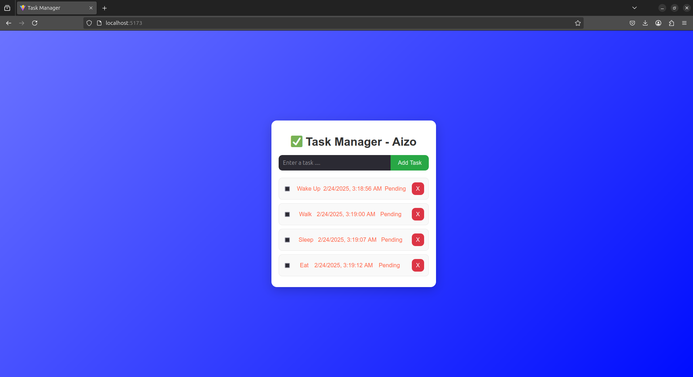

# ✅ Task Manager

A Task Manager built with React (Vite). This app provides a seamless and user-friendly experience for managing daily tasks with a sleek UI, beautiful animations, and persistent data storage. 

## Features

#### ✔ Task Management – Easily add, complete, and delete tasks with a simple interface.
#### ✔ Local Storage Support – Tasks persist even after refreshing the page.
#### ✔ Responsive Design – Fully optimized for all screen sizes.
## Screenshot




## Project Structure

# Task Manager

A simple and efficient task management application built with React and Vite.

## 📂 Project Structure

```plaintext
📦 task-manager
┣ 📂 src
┃ ┣ 📂 components
┃ ┃ ┣ 📜 TaskInput.jsx    
┃ ┃ ┣ 📜 TaskList.jsx     
┃ ┃ ┣ 📜 TaskItem.jsx     
┃ ┣ 📜 App.jsx           
┃ ┣ 📜 main.jsx          
┃ ┣ 📜 App.css           
┣ 📜 index.html          
┣ 📜 package.json        
┣ 📜 README.md          
┣ 📜 vite.config.js      
┣ 📂 public
┃ ┣ 📜 screenshot.png    
```


## 🚀 Getting Started

Follow these simple steps to set up and run the project locally:
####  1️⃣ Clone the Repository

```bash
  git clone https://github.com/aizocraft/task-manager.git
```

```bash
   cd task-manager
```

####  2️⃣ Install Dependencies

```bash
   npm install
```
####  3️⃣ Run the Application

```bash
   npm run dev
```

Your app should now be running at http://localhost:5173/ 🚀

## 🔧 Technologies Used
 
**React (Vite) 🚀** - Fast, efficient, and optimized development experience.

**CSS3 🎨** - Beautiful styling and responsive layouts.

**JavaScript (ES6+) ⚡**- Modern scripting for seamless functionality.

**Local Storage 💾**- Keeps tasks saved even after closing the browser.

## License

[MIT](https://choosealicense.com/licenses/mit/)

